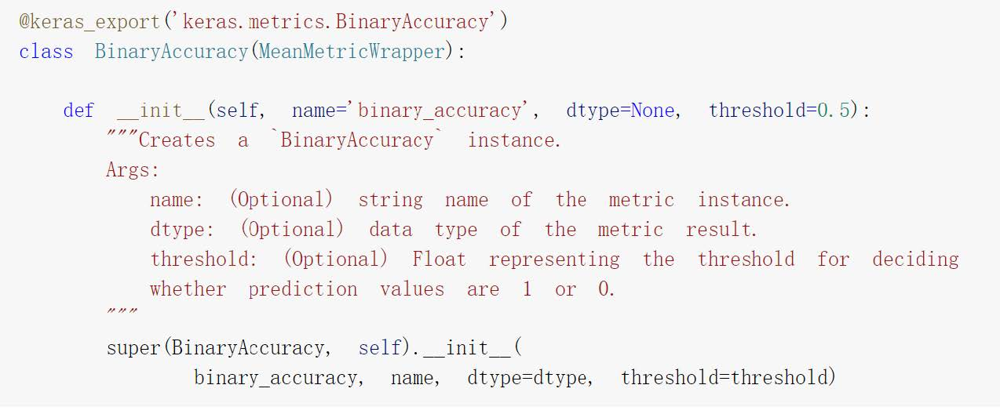
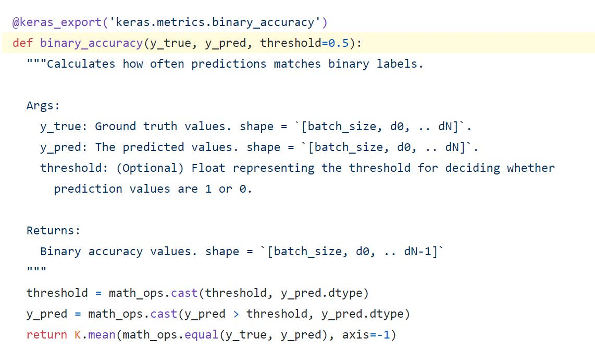
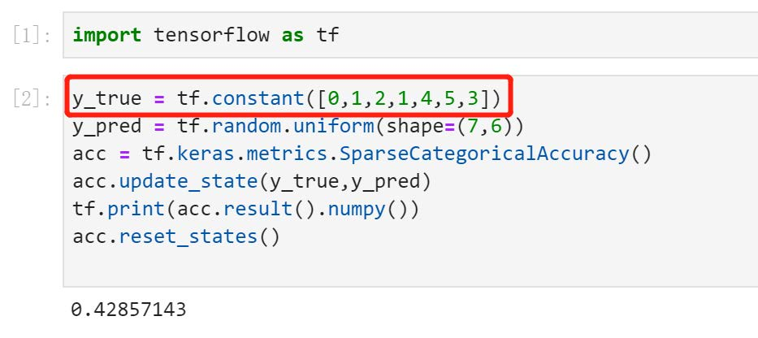
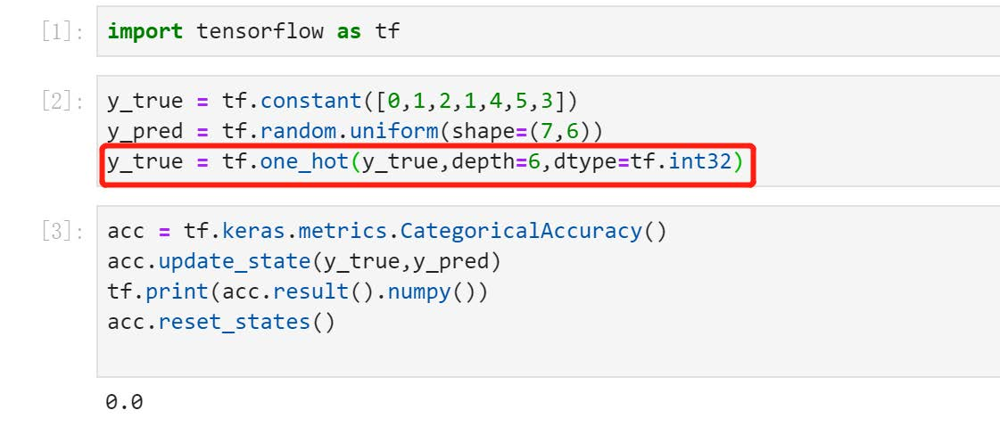

# 常用评估函数与自定义评估函数
> 1. 常用的评估函数
> 2. 自定义评估函数
> 3. 案例讲解

# 01. 常用的评估函数
`tf.keras.metrics` (TF1.x -> `tf.metrics`的接口均移到这里)

官方API: https://www.tensorflow.org/versions/r2.0/api_docs/python/tf/keras/metrics

`tf.keras.metrics.BinaryAccuracy` and `tf.keras.metrics.binary_accuracy`有什么区别?

前者是类的实现形式，后者是函数的实现形式。

BinaryAccuracy 和 binary_accuracy 的实现方式


用于回归的评估函数
* `tf.keras.metrics.MeanAbsoluteError`(平方差误差，用于**回归**，可以简写为MSE, 函数形式为`mse`)
* `tf.keras.metrics.MeanAbsoluteError`(绝对值误差，用于**回归**，可以简写为MAE，函数形式为`mae`)
* `tf.keras.metrics.MeanAbsolutePercentageError`(平均百分比误差，用于**回归**，可以简写为MAPE，函数形式为`mape`)
* `tf.keras.metrics.RootMeanSquaredError`(均方根误差，用于**回归**)

用于分类的评估函数
* `tf.keras.metrics.Accuracy`(准确率，用于分类，可以用字符串"Accuracy"表示，Accuracy=(TP+TN)/(TP+TN+FP+FN)，要求y_true和y_pred都为类别序号编码)
* `tf.keras.metrics.AUC`(ROC曲线(TPR vs FPR)下的面积，用于二分类，直观解释为随机抽取一个正样本和一个负样本，正样本的预测值大于负样本的概率)
* `tf.keras.metrics.Precision`(精确率，用于二分类，Precision = TP/(TP+FP))
* `tf.keras.metrics.Recall`(召回率，用于二分类，Recall = TP/(TP+FN))
* `tf.keras.metrics.TopKCategoricalAccuracy`(多分类TopK准确率，要求y_true(label)为onehot编码形式)
* `tf.keras.metrics.CategoricalAccuracy`(分类准确率，与Accuracy含义相同，要求**y_true(label)为onehot编码形式**)
* `tf.keras.metrics.SparseCategoricalAccuracy`(稀疏分类准确率，与Accuracy含义相同，要求**y_true(label)为序号编码形式**)



> 官方API：https://tensorflow.google.cn/api_docs/python/tf/keras/metrics

```python
m = tf.keras.metrics.Accuracy()
m.update_state([1, 2, 3, 4], [0, 2, 3, 4])
# 还可以这样简写
# m([1, 2, 3, 4], [0, 2, 3, 4])
print('Final result: ', m.result().numpy())
# Final result: 0.75

m.update_state([1, 2, 3, 4], [0, 2, 3 ,1])
print ('Final result: ', m.result().numpy()
#Final result: 0.65
m.reset_states()  # 重置
```
