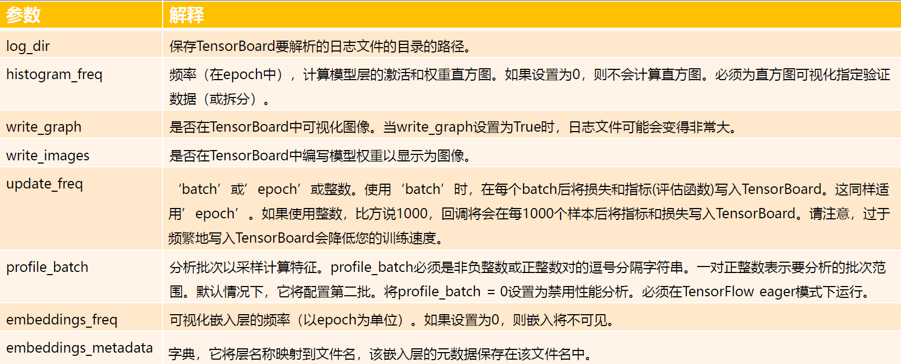

# TensorBoard
> 1. TensorBoard 简介
> 2. keras训练中使用
> 3. 自定义训练中使用


TensorBoard是一个在深度学习中很好的可视化训练过程和模型结构的工具，那么，要怎么才能在TensorFlow2.0中使用它呢?

在TensorFlow2.0中，训练一个神经网络模型主要有两种方式:
* 使用`tf.keras`模块的`Model.fit()`;
* 使用`tf.GradientTape()`求解梯度，这样可以自定义训练过程。

对于这两种方案，都可以使用TensorBoard，下面以在MNIST数据集上训练一个图像分类模型为例介绍。

# 02. Keras训练过程中使用Tensorboard

Keras在回调函数中内置Tensorboard函数:
```python
tf.keras.callbacks.TensorBoard(
    log_dir='logs',
    histogram_freq=0,
    write_graph=True,
    write_images=False,
    update_freq='epoch',
    profile_batch=2,
    embeddings_freq=0,
    embeddings_metadata=None
```



```python
model = MyModel()
model.compile(
    optimizer='adam',
    loss='sparse_categorical_crossentropy',
    metrics=['accuracy'])

tensorboard_callback = tf.keras.callbacks.TensorBoard(
    log_dir="keras_logv1",
    histogram_freq=1,
    profile_batch = 100000800)

model.fit(
    x=x_train,
    y=y_train,
    epochs=1,
    validation_data=(x_test, y_test),
    callbacks=[tensorboard_callback])
```

Tensorboard界面解释
* `Scalars`: 显示了如何将loss与每个时间段改变。还可以使用它来跟踪训练速度，学习率和其他标量值。
* `Graphs`: 进行可视化模型。在这种情况下，将显示层的Keras图，这可以帮助你确保模型正确构建。
* `Distributions`和`Histograms`: 显示张量随时间的分布。这对于可视化权重和偏差并验证它们是否以预期的方式变化很有用。

# 03. 自定义训练中使用
```python
tf.summary.create_file_writer(
    logdir, max_queue=None, flush_millis=None, filename_suffix=None, name=None
)
```

| logdir | 文件夹路径 |
| :-----| :----: |
| max_queue | 最多在缓存中暂存max_queue个数据，当超过max_queue个时，flush更新到日志文件中并清空缓存。默认为10。|
| flush_millis | 至少flush_millis毫秒内进行一次flush。默认为120,000毫秒。|
| filename_suffix | 日志文件的后缀。默认为.v2 |
| name | (tf1.0残余特性，请忽略它）本操作的名称。|

> 官方API：https://tensorflow.google.cn/api_docs/python/tf/summary/create_file_writer#args

summary写入函数：
* `tf.summary.scalar()`: 保存单个数值。在tensorboard中将生成折线图。
* `tf.summary.histogram()`: 保存一个张量。直方图或密度图。
* `tf.summary.text()`: 保存一个tf.string类型的Tensor。文本。
* `tf.summary.image()`: 保存形状为[k,h,w,c]的Tensor。图片。
* `tf.summary.audio()`: 保存形状为[k,t,c]的Tensor。音频。


查看`Graph`和`Profile`信息
* `tf.summary.trace_export()`: 停止trace，并将之前trace记录到的信息写入profiler日志文件。
* `tf.summary.trace_off()`: 停止trace，并舍弃之前trace记录。
* `tf.summary.trace_on()`: 开始trace以记录计算图和分析信息。
