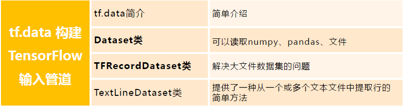

# `tf.data` 简介
> 1. `tf.data`初探
> 2. `Dataset`类
> 2.1 数据集实例化
> 2.2 数据集处理
> 3. `TFRecordDataset`类
> 4. `TextLineDataset`类

# 01. `tf.data`初探
面对一堆格式不一的原始数据文件?读入程序的过程往往十分繁琐?运行的效率上不尽如人意?

`TensorFlow`提供了`tf.data`这一模块，包括了一套灵活的数据集构建API，能够帮助我们快速、高效地构建数据输入的流水线，尤其适用于数据量巨大的场景。
* `tf.data.Dataset`类
* `tf.data.TFRecordDataset`类
* `tf.data.TextLineDataset`类
> 官方API：https://tensorflow.google.cn/api_docs/python/tf/data
> 
# 02. `Dataset`类
`tf.data` 的核心是 `tf.data.Dataset`类，提供了对数据集的高层封装。`tf.data.Dataset`由一系列的可迭代访问的元素(element)组成，每个元素包含一个或多个张量。`Dataset`可以看作是相同类型“元素”的有序列表。

比如说，对于一个由图像组成的数据集，每个元素可以是一个形状为**长×宽×通道数**的图片张量，也可以是由图片张量和图片标签张量组成的元组（Tuple).

## 2.1 数据集实例化
`tf.data.Dataset`类创建数据集，对数据集实例化。最常用的几个创建数据集操作，如:
* `tf.data.Dataset.from_tensors()`: 创建Dataset对象，合并输入并返回具有单个元素的数据集。
* `tf.data.Dataset.from_tensor_slices()`: 创建一个Dataset对象，输入可以是一个或者多个 tensor，若是多个tensor，需要以元组或者字典等形式组装起来。
* `tf.data.Dataset.from_generator()`:迭代生成所需的数据集，一般数据量较大时使用。
  
> 注:Dataset可以看作是相同类型“元素”的有序列表。在实际使用时，单个“元素”可以是向量，也可以是字符串、图片，甚至是tuple或者dict。


> https://tensorflow.google.cn/api_docs/python/tf/data/Dataset

`from_tensors()`和`from_tensor_slices()`区别?

答：`from tensors`函数会把传入的tensor当做一个元素，但是`from tensor_slices()`会把传入的tensor除开第0维之后的大小当做元素个数。


Numpy数据:
假设有一个`feature`数组和相应的标签数组，将两个数组作为元组传递给`tf.data.Dataset.from_tensor_slices`以创建`tf.data.Dataset`


Pandas数据:
使用`tf.data.Dataset.from_tensor_slices` 从 `pandas dataframe`中读取数值。


`tf.data.Dataset.from_generator()`
主要针对大数据量输入


## 2.2 数据集处理
`tf.data.Dataset`类为我们提供了多种数据集预处理方法。最常用的如:
* `tf.data.Dataset.map(f)`: 对数据集中的每个元素应用函数f，得到一个新的数据集(这部分往往结合tf.io进行读写和解码文件，tf.image进行图像处理);
* `tf.data.Dataset.shuffle(buffer_size)`∶将数据集打乱（设定一个固定大小的缓冲区(Buffer)，取出前buffer_size个元素放入，并从缓冲区中随机采样，采样后的数据用后续数据替换）;
* `tf.data.Dataset.batch(batch_size)`∶ 将数据集分成批次，即对每batch_size个元素，使用tf.stack()在第О维合并，成为一个元素;

# 03. `TFRecordDataset`类
对于特别巨大而无法完整载入内存的数据集，我们可以先将数据集处理为`TFRecord格式`，然后使用`tf.data.TFRecordDataset()`进行载入。`TFRecord` 是TensorFlow中的数据集存储格式。当我们将数据集整理成`TFRecord格式`后，TensorFlow 就可以高效地读取和处理这些数据集，从而帮助我们更高效地进行大规模的模型训练。

工业化应用广泛。

```python
tf.data.TFRecordDataset(
    filenames, compression_type=None, buffer_size=None, num_parallel_reads=None
)
```
* `filenames`: tf.string张量，值为一个或多个文件名。
* `compression_type`: tf.string标量，值为“"(不压缩)、"ZLIB"或"GZIP"之一。
* `buffer_size`: tf.int64标量，表示读取缓冲区中的字节数。
* `num_parallel_reads`: tf.int64标量，表示要并行读取的文件数。

`TFRecordDataset` 使用方法实例


# 04. `TextLineDataset`类
`tf.data.TextLineDataset`提供了一种从一个或多个文本文件中提取行的简单方法。

给定一个或多个文件名，`TextLineDataset`会为这些文件的每行生成一个字符串值元素。像`TFRecordDataset`一样，`TextLineDataset`将`filenames`视为`tf.Tensor`。

类中保存的元素: 文中一行，就是一个元素，是string类型的tensor。

```python
tf.data.TextLineDataset(
    filenames, compression_type=None, buffer_size=None, num_parallel_reads=None
)
```
* `filenames`: tf.string张量，值为一个或多个文件名。
* `compression_type`: tf.string标量，值为“"(不压缩)、"ZLIB"或"GZIP"之一。
* `buffer_size`: tf.int64标量，表示读取缓冲区中的字节数。
* `num_parallel_reads`: tf.int64标量，表示要并行读取的文件数。


# 总结
